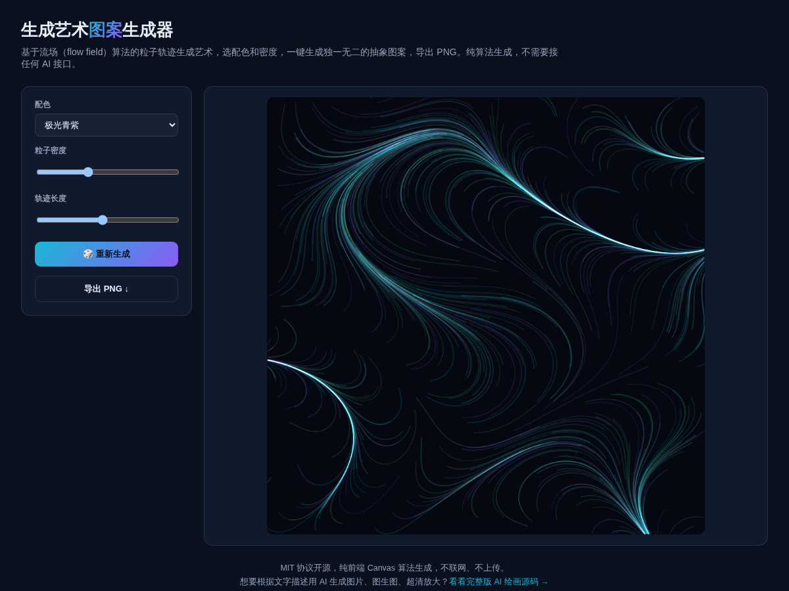

# 生成艺术图案生成器 · Flow Field Art

**[在线体验 →](https://anna123123123-creator.github.io/generative-art/)**

免费开源、纯浏览器运行的生成艺术工具。基于流场（flow field）算法绘制粒子轨迹，选配色和密度，一键生成独一无二的抽象图案，导出 PNG。纯算法生成，不需要接任何 AI 接口，不联网。



## 试用方法

直接用浏览器打开 `index.html`，或用静态文件服务器跑起来：

```bash
python3 -m http.server 8000
```

## 实现原理

用几个叠加的正弦/余弦函数构造一个平滑变化的"方向场"（每个坐标点对应一个角度），撒几百个粒子，每个粒子沿着所在位置的场方向逐步移动并画出轨迹，用 `globalCompositeOperation = 'lighter'` 叠加混合，多条半透明轨迹交织出流动、有机的图案效果。每次点击"重新生成"会换一个随机种子，图案完全不重复。`script.js` 里大概 60 行原生 JavaScript。

## 协议

MIT。

## 相关项目

这个是做 **AI 绘画**产品时顺手做的免费小工具——纯算法生成抽象图案，不理解文字描述、生成不了具象内容。完整版是根据文字描述用 AI 生成图片、图生图、超清放大、多模型接入，源码在这：[全能源码 · AI 绘画网站源码](https://inzyxuashop.com/aihuihua-yuanma.html)。
